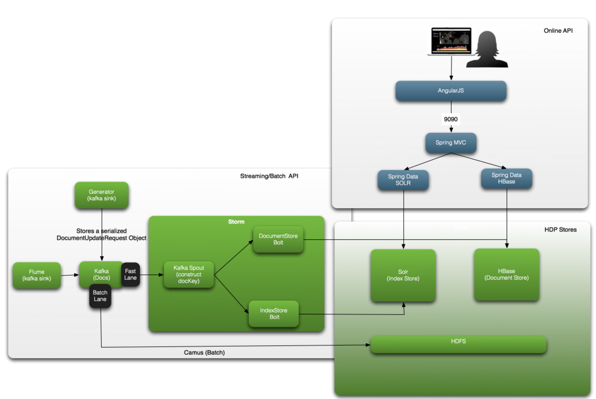
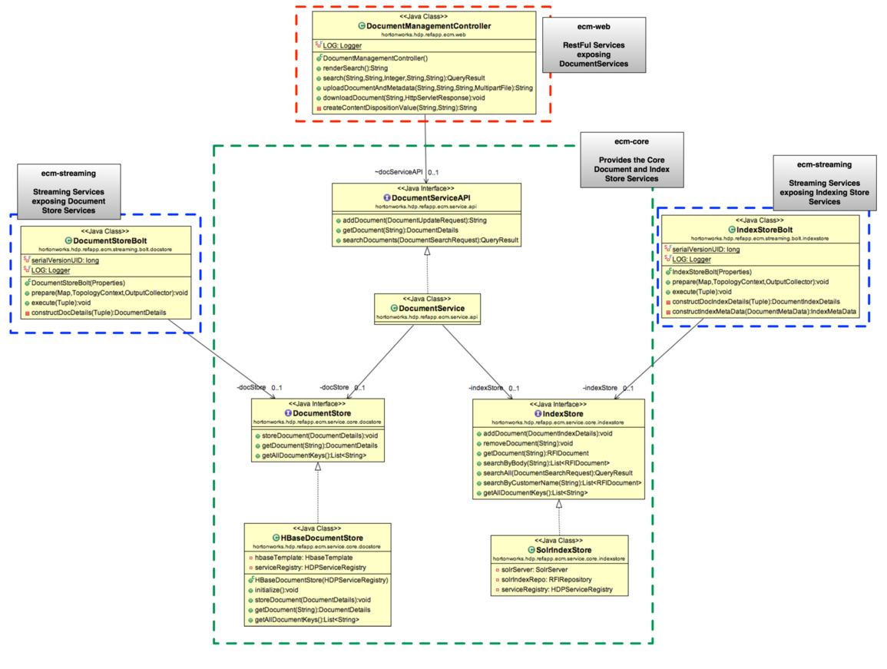

# Reference Architecture
The High Level Reference Architecture consists of the following: 

1. **HBase** - as the system of record for the documents/images including thumbnails.  We will be working with our HBase engineering team on some enhancements to make this work performant. 
2. **SOLR** - acting as the system of record for the the metadata and providing the indexing and searching capabilities. We will be working with some experts from Lucidworks to make this performant. 
3. When a user queries  for a content via metadata, we will use Solr to query the index. The  solr query will return a unique hbase row key which will be used to quickly retrieve the image from Hbase. 
3. **Kafka** - Documents will be pushed to Kafka for Streaming, Batch and B2B integration
4. **Spring Data Solr ** - Set of scripts to setup the cluster
5. **Spring Data Solr** - Provides abstraction on top of Solr 
6. **Spring HBase** - Provides an abstraction on top of HBase
7. **Spring MVC** - Provides a REST interface to expose DocumentStore and IndexStore services

Hence this solution is a classic Hbase+Solr model to implement the search application.  Solr for text search on image metadata and HBase as a system-of-record for storing documents/images in it's original form as blobs.

The following diagram provides more details on this Ref Architecture:

## Business Use Case Setup

Common Use Case Requirements that see around re-platforming their existing ECM to HDP are the following:

*  Migrating image documents from the existing solution to the new solution creating services to ingest the image documents
* Creating image document ingestion services building on what was created for the migration ingestion
* Creating the index services on top of the document and metadata
* Creating an OCR/Analytics Framework for systematic mining of the image documents
* Ability to upload, index, update, retrieve and update documents and their corresponding metadata via the following mechanism:

# Reference App Development Artifacts
This project is meant to be a reference application/assembly for an IOT use case. The project consists of 5 projects:

1. **ecm-core** - Core capabilities/APIs for the DocumentStore and IndexStore. This will be used by the streaming and online applications.
2. **ecm-streaming** - Storm Topology for the Document Porcessing. Uses ecm-core to interact with Index and Image Store
3. **ecm-ambari-view** - An Ambari View for the the ECM Reference App
4. **ecm-ingestion** - Provides ingestion utilities such as: Custom Kafka Flume Sink that supports storing a serialized "DocumentUpdateRequest" object and Customer Flume DocumentInterceptor that extracts metadata of the document from the file name
5. **ecm-common** - Common Classes used by the above 4 projects including: Common API DTO classes and Common Utilities

# Architecture around the Core Document and Indexing Services
The below UML class diagram demonstrates how the different projects are used together.

