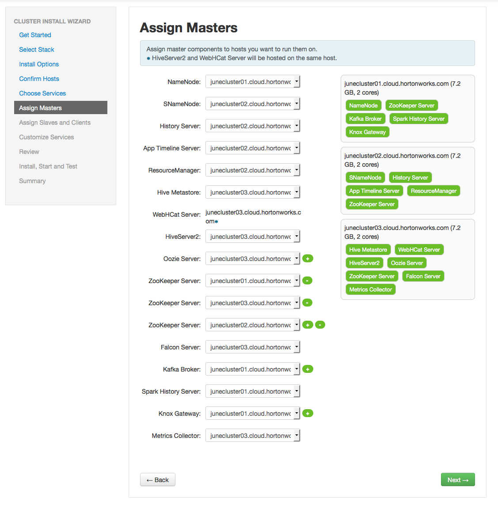
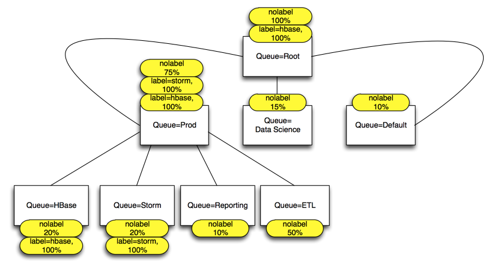
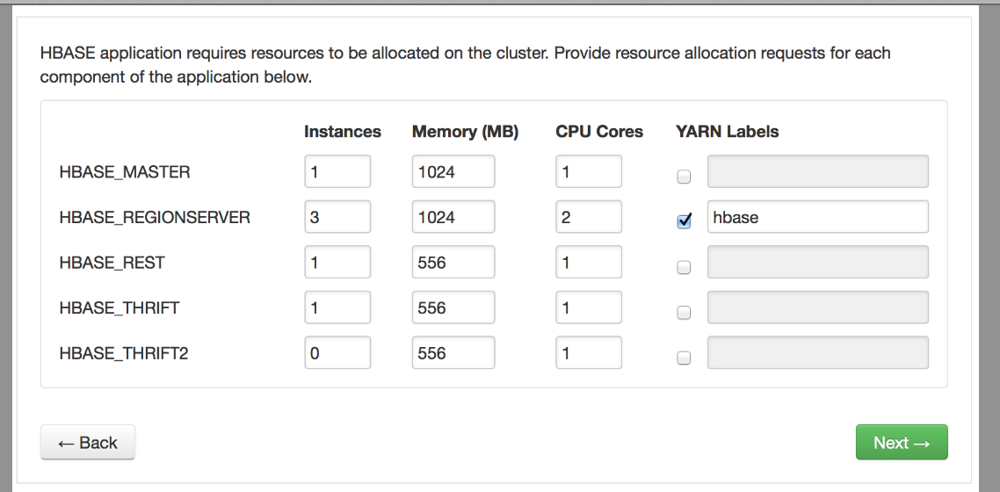
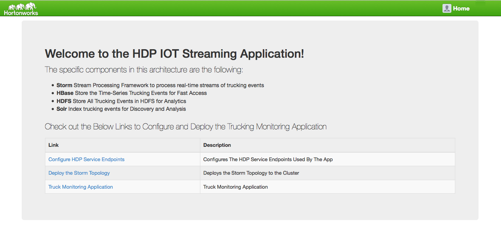
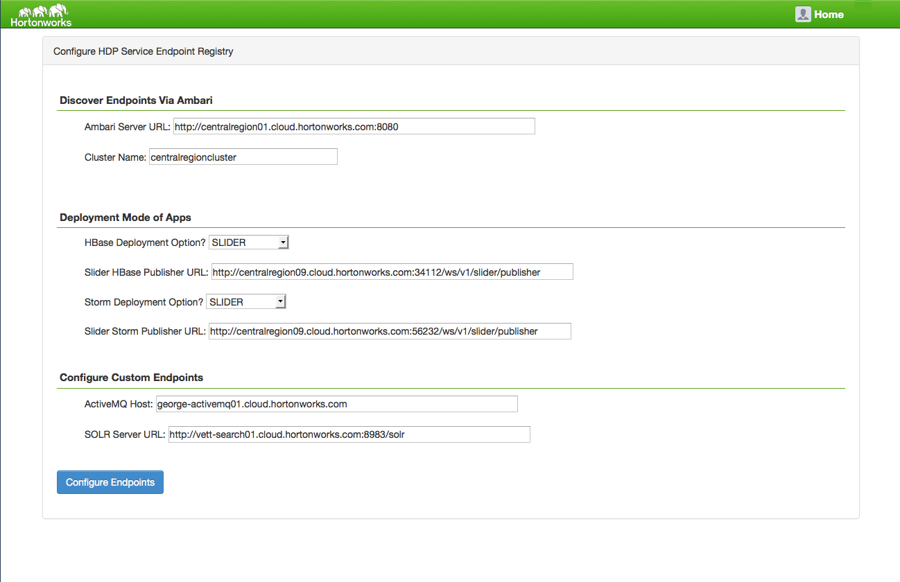
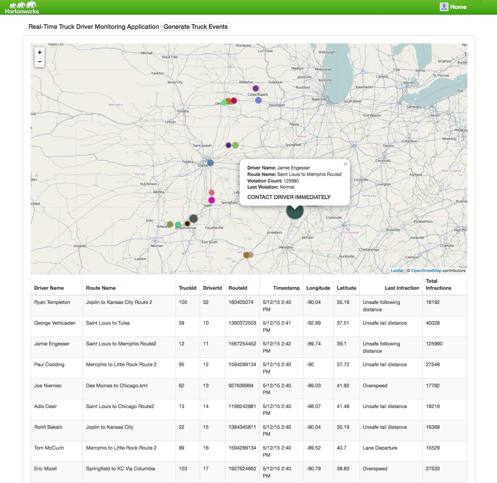

# IOT Trucking Reference Application
This project is meant to be a reference application/assembly for an IOT use case. The project consists of 5 projects:

1. **trucking-data-simulator** - Data simulator that allows you spin N number of Trucks emitting X number of events
2. **trucking-domain-objects** - Common trucking domain objects used across projects
3. **trucking-storm-topology** - Storm Topology to process trucking events in realtime
4. **trucking-env-setup** - Set of scripts to setup the cluster
5. **trucking-web-portal** - A web application that allows you to deploy the storm topoloyg and tap into the real-time trucking data using websockets from Active/MQ and Storm

## Business Use Case Setup

* Sensor devices from trucks captures events of the trucks and actions of the Driver.
* Some of these driver events are dangerous "events” such as: Lane Departure, Unsafe following distance, Unsafe tail distance
* The Business Requirement is to stream these events in, filter on violations and do real-time alerting when “lots” of erratic behavior is detected for a given driver over a short period of time.

## What does this Reference Application Demonstrate
* Stream Processing
* Search/Indexing
* Interactive Query
* Real-time CRUD
* Data Science
* Platform Capabilities including Multi-Tenancy, Security, Data Pipelines, and LIneage/Users/gvetticaden/Dropbox/Hortonworks/Development/Git/hdp/reference-apps/iot-trucking-app/README.md

## IOT Trucking App Storm Architecture 

## Installing and Running the IOT Trucking App (Without Slider Apps)

### Cluster Setup
Ideally, to showcase all of the capabilities of the Platform, it is recommended that you have at least a 10 nodes with at atleast 7GB of memory and 2 virtual cores. 

There are two primary ways to spin up a cluster using Ambari:

1. Using [SequenceIQ Cloudbreak](http://sequenceiq.com/cloudbreak/)  to provision a cluster on Azure, AWS or Google Compute in a matter of minutes. To provision a cluster using Cloudbreak, see [CloudBreak Github](https://github.com/sequenceiq/cloudbreak)
2. Using [Ambari 2.X automated installer](http://docs.hortonworks.com/HDPDocuments/Ambari-2.0.0.0/bk_Installing_HDP_AMB/content/ch_Getting_Ready.html) 
   

Regardless of whatever approach is chosen to provision a cluster, ensure the following during cluster setup and post install:

1. Via Ambari, install all Services except for HBase and Storm. We will be provisioning HBase and Storm via Slider so it is managed via Yarn/Slider
2. Install all the clients on at least one of the nodes.

A common out of the box approach to assign masters and slaves to a 8 node cluster is the following

### Set up the Maven Projects and setup scripts

1. SSH into an edge node
2. Create Few Directories 
    * mkdir workspace
    * cd workpace
    * mkdir lib
2. Ensure that JDK 1.7 is installed
3. Install git
	* yum install git
4. Install Python3
	* cd workspace/lib
	* Follow [Install Python 3](http://www.shayanderson.com/linux/install-python-3-on-centos-6-server.htm)
4. Install Maven
	* cd workspace/lib
	* wget ftp://mirror.reverse.net/pub/apache/maven/maven-3/3.3.3/binaries/apache-maven-3.3.3-bin.tar.gz
	* tar -zxvf apache-maven-3.3.3-bin.tar.gz 
5. Clone the Repo: 
	* cd workspace
	* git clone https://georgevetticaden@github.com/georgevetticaden/hdp.git

### Node Label Assignment
Node Labels provides the ability to run certain workloads on certain set of nodes on the cluster. This might be useful when you want to carve out certain nodes for certain workloads that require certain set of resources. In this reference application, we are going create node labels for storm and hbase so that these long running services are scheduled on only certain set of nodes.  

We will be creating 2 node labels called "hbase" and "storm" and then assign them each to 2 seperate nodes in our 8 node cluster. It will look somethign like the following:

The following walks you through how to do this:

1. Read through the following documentation [Configuring Nodel Labels](http://docs.hortonworks.com/HDPDocuments/HDP2/HDP-2.2.4/bk_yarn_resource_mgt/content/ref-7302fe4c-1e7c-4d32-9c62-18b9809d6fd1.1.html)
2. Setup Node Labels Directories (Execute teh following as root)
	* cd workspace/hdp/reference-apps/iot-trucking-app/trucking-env-setup/environment/prod/setup/labels
	* [./nodeLabelsSetup.sh](https://github.com/georgevetticaden/hdp/blob/master/reference-apps/iot-trucking-app/trucking-env-setup/environment/prod/setup/labels/nodeLabelsSetup.sh)
3. In Ambari, make the following Yarn config changes (under 'Advanced yarn-site' tab) and restart the YARN service:
	* yarn.node-labels.manager-class=org.apache.hadoop.yarn.server.resourcemanager.nodelabels.RMNodeLabelsManager
	* yarn.node-labels.fs-store.root-dir=hdfs://YOUR_FQDN_NN_HOST:8020/yarn/node-labels
4. Create Node Labels and assign each of the 2 node labels to 2 seperate hosts on your cluster
	* cd workspace/hdp/reference-apps/iot-trucking-app/trucking-env-setup/environment/prod/setup/labels
	* Edit file [nodeLabelCreationAndAssignment.sh](https://github.com/georgevetticaden/hdp/blob/master/reference-apps/iot-trucking-app/trucking-env-setup/environment/prod/setup/labels/nodeLabelCreationAndAssignment.sh) and modify the host names to the relative ones in your cluster.
	* [./nodeLabelCreationAndAssignment.sh](https://github.com/georgevetticaden/hdp/blob/master/reference-apps/iot-trucking-app/trucking-env-setup/environment/prod/setup/labels/nodeLabelCreationAndAssignment.sh)

5. Verify Node Lables were assigned to the nodes
	* yarn node -list
    * yarn node -status <Node_ID>

### Configure Capacity Scheduler Queues
The default scheduler within HDP Yarn is the Capacity Scheduler. Capacity Scheduler has the notion of queues that allows you to carve up the resources of the clusters to different applications or business units. Two powerful capabilities of the capacity scheduler that we will use are teh following:

1. [Hierarchal Queues](http://docs.hortonworks.com/HDPDocuments/HDP2/HDP-2.2.4/bk_yarn_resource_mgt/content/ref-4e3db754-a63c-42ff-b3d4-d808b4381fd2.1.html)
	* Ensure resources are shared among the sub-queues of an organization before other queues are allowed to use free resources, there-by providing affinity for sharing free resources among applications of a given organization
2. [Assign Node Labels to Queues](http://docs.hortonworks.com/HDPDocuments/HDP2/HDP-2.2.4/bk_yarn_resource_mgt/content/ref-7302fe4c-1e7c-4d32-9c62-18b9809d6fd1.1.html) 
 	* By assigning node labels to a certain queue, then any job that gets submitted to that queue will only be scheduled on the nodes with that label.

The below pic describes how we will configure the queues. Note that only leaf queues will have jobs submitted to it. All Data science jobs will the submitted to teh Data Science queue which will have 10% of the cluster. 90% of the cluster will be given to parent queue called Prod. Under Prod, there are 4 Queues:

1. HBase
	* Has label called hbase which is allocated 100%. This means that when a job gets submitted to this queue with label hbase, then it has access to 100% of the resources on the nodes with label hbase. So in our case 100% of resoruces of Node 4 and Node 5. As we will see when create an HBase slider App, Hbase components like the regions servers will be submitted to this queue with label HBase. 
	* Has label called nolabel which is allocated 20% of 75% of the cluster. This means that when a job gets submitted to this queue with no label assignment, then it will be allocated 15% of resources across all nodes with no label. So in our case, it will have access to 15% of the resources across Nodes 1,2,3 and 8. As we will see when create an HBase slider App, Hbase components like the Hbase Master will be submitted to this queue with no label
2. Storm
	* Configured Similar to HBase
3. Reporting
	* Any reporting/hive queries will use this queue which has 10% of 75% of the cluster resources with no label
4. ETL
	* Any falcon/oozie etl jobs will be submitted to this queue which has 50% of the 75% of the cluster resources with no label

The following are the steps to configure the CS Queues as described above.

1. Read  through [Configuring Capacity Scheduler](http://docs.hortonworks.com/HDPDocuments/HDP2/HDP-2.2.4/bk_yarn_resource_mgt/content/ch_capacity_scheduler.html).
2. cd workspace/hdp/reference-apps/iot-trucking-app/trucking-env-setup/environment/prod/setup
3. modify the [config.properties](https://github.com/georgevetticaden/hdp/blob/master/reference-apps/iot-trucking-app/trucking-env-setup/environment/prod/setup/config.properties) to configure the ambari host and credentials. We will be use the rest API to update the capacity scheduler config
4. cd workspace/hdp/reference-apps/iot-trucking-app/trucking-env-setup/environment/prod/setup/queue
5. edit [main_updateCSQueue.py](https://github.com/georgevetticaden/hdp/tree/master/reference-apps/iot-trucking-app/trucking-env-setup/environment/prod/setup/queue) and make sure sys.path.insert 2 arg is pointing to the right path
6. Call the python script that configure the capacity scheduler queue via Ambari APIs:
	* python3 main_updateCSQueue.py 
7. Update the the following yarn config property (in scheduler stab)and restart the Yarn service
	* yarn.scheduler.minimum-allocation-mb = 682	

### Slider Setup

##### 1. Install the Slider View

1. Click on Admin Tab --> Manage Ambari
2. Click Deploy View --> Click Slider --> Create Instance
3. Configure the View With your cluster details

##### 2. Install the HBase and Storm Slider Libraries into Ambari
1. Login to the Ambari Host as ro2. . 
2. Execute the commands in the script [Setup Slider](https://github.com/georgevetticaden/hdp/blob/master/reference-apps/iot-trucking-app/trucking-env-setup/environment/prod/setup/slider/main_setupSlider.sh) 

### Create an Instance of the HBase Slider App
Now That we have configured node labels and carved up the resources of our clsuter using the Capacity Scheduler, it is now to create an instance of the HBase app managed by Yarn. 

Go the Slider View --> Create App
##### 1.  Select Type
Select HBASE App type, provide name, configure the queue name as "hbase" and configure yarn labels as any host

##### 2.  Select Allocate Resources

##### 3.  Configuration

Leave the Defaults
##### 4.  Deploy

Clikc Deploy

#### Create an Instance of the Storm Slider App

Go the Slider View --> Create App
##### 1.  Select Type
Select HBASE App type, provide name, configure the queue name as "hbase" and configure yarn labels as any host

##### 2.  Select Allocate Resources

##### 3.  Configuration

Leave the Defaults
##### 4.  Deploy

Clikc Deploy

### Install & Configure ActiveMQ 5.9.8
ActiveMQ is required for the Storm Topology to push alerts to and for the trucking-web-portal's websocket connection to show driver events in real-time
Do the following the edge Node:

1. wget http://archive.apache.org/dist/activemq/apache-activemq/5.9.0/apache-activemq-5.9.0-bin.tar.gz
2. Untar the binary
3. Start ActiveMQ by running the following: 
apache-activemq-5.9.0/bin/activemq start xbean:file:/mnt/activemq/apache-activemq-5.9.0/conf/activemq.xml
4. Verify it is up by running:
activemq/apache-activemq-5.9.0/bin/activemq status

### Install & Configure SOLR 4.10
Do the Following on the edge Node

1. Install Solr 4.10 from here: http://archive.apache.org/dist/lucene/solr/4.10.0/solr-4.10.0.tgz using instructions from here: https://cwiki.apache.org/confluence/display/solr/Installing+Solr
2. Create a solr core called truck_event_logs
3. For the core created in step 2, use schema.xml found here: XXXX

### Download and Build the Code
Do the Following on the Edge Node

1. Install Git
2. Install Maven
3. git clone https://george.vetticaden@github.com/georgevetticaden/hdp.git
6. Hite the Url

### Configure HDFS
Do the following on the edge Node

1. su hdfs
2. Run the script in hdp/reference-apps/iot-trucking-app/trucking-env-setup/environment/prod/setup/hdfs/createDirsInHDFS.sh

### Configure Hive
Do the following on the edge Node

1. su hdfs
2. Run both the ddls located in hdp/reference-apps/iot-trucking-app/trucking-env-setup/environment/prod/setup/hive

### Configure HBase
Do the following on the edge node (or where you have hbase client running)

1. Run the hbase script located in hdp/reference-apps/iot-trucking-app/trucking-env-setup/environment/prod/setup/hbase/createHBaseTables
2. This should have created 3 tables in Hbase: driver_dangerous_events, driver_dangerous_events_count and driver_events
 

### Configure Kafka
Do the following on the edge node (or where you have Kafka Broker/client running)

1. Create a kafka topic called truck_events with 5 partitions and 1 replica by executing somethign liek the following: 

/mnt/kafka/kafka_2.8.0-0.8.0/bin/kafka-create-topic.sh --zookeeper zookeeper_host:2181 --replica 1 --partition 5 --topic truck_events 

### Run the trucking-web-portal
Do the Following on the Edge Node

1. Go to the directory where you cloned the repo in section Download and Build the Code
2. cd to hdp/reference-apps/iot-trucking-app
3. mvn clean install -DskipTests=true
4. cd to trucking-web-portal
5. mvn jetty:run -X -Dservice.registry.config.location=[REPLACE_WITH_DIR_YOU_CLONED_TO]/hdp/reference-apps/iot-trucking-app/trucking-web-portal/src/main/resources/config/dev/registry
6. Hit the portal URL: http://[edge_node_hostname]:8080/iot-trucking-app/ You should See this:

7.Configure the Application with HDP Service Endpoints:

8.Generate the Truck Event Streams

9.View Truck Alerts

