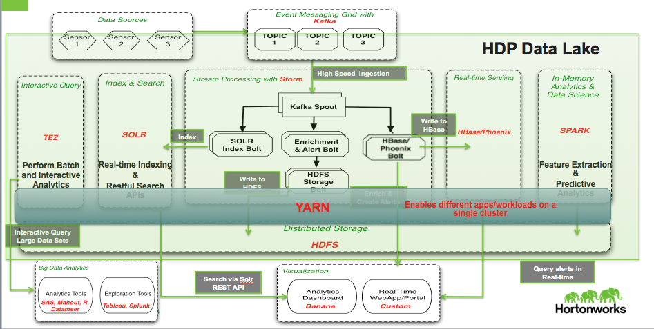

# IOT Trucking Reference Application
This project is meant to be a reference application/assembly for an IOT use case. The project consists of 4 projects:

1. **trucking-data-simulator** - Data simulator that allows you spin N number of Trucks emitting X number of events
2. **trucking-domain-objects** - Common trucking domain objects used across projects
3. **trucking-storm-topology** - Storm Topology to process trucking events in realtime
4. **trucking-env-setup** - Set of scripts to setup the cluster
5. **trucking-web-portal** - A web application that allows you to deploy the storm topoloyg and tap into the real-time trucking data using websockets from Active/MQ and Storm

## Business Use Case Setup

* Sensor devices from trucks captures events of the trucks and actions of the Driver.
* Some of these driver events are dangerous "events” such as: Lane Departure, Unsafe following distance, Unsafe tail distance
* The Business Requirement is to stream these events in, filter on violations and do real-time alerting when “lots” of erratic behavior is detected for a given driver over a short period of time.

## What does this Reference Application Demonstrate
* Stream Processing
* Search/Indexing
* Interactive Query
* Real-time CRUD
* Data Science
* Platform Capabilities including Multi-Tenancy, Security, Data Pipelines, and LIneage

## IOT Trucking App Storm Architecture 

## IOT Trucking App Data Pipline Architecture 

## Installing and Running the IOT Trucking App
Coming Soon...