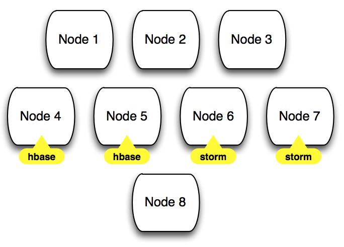
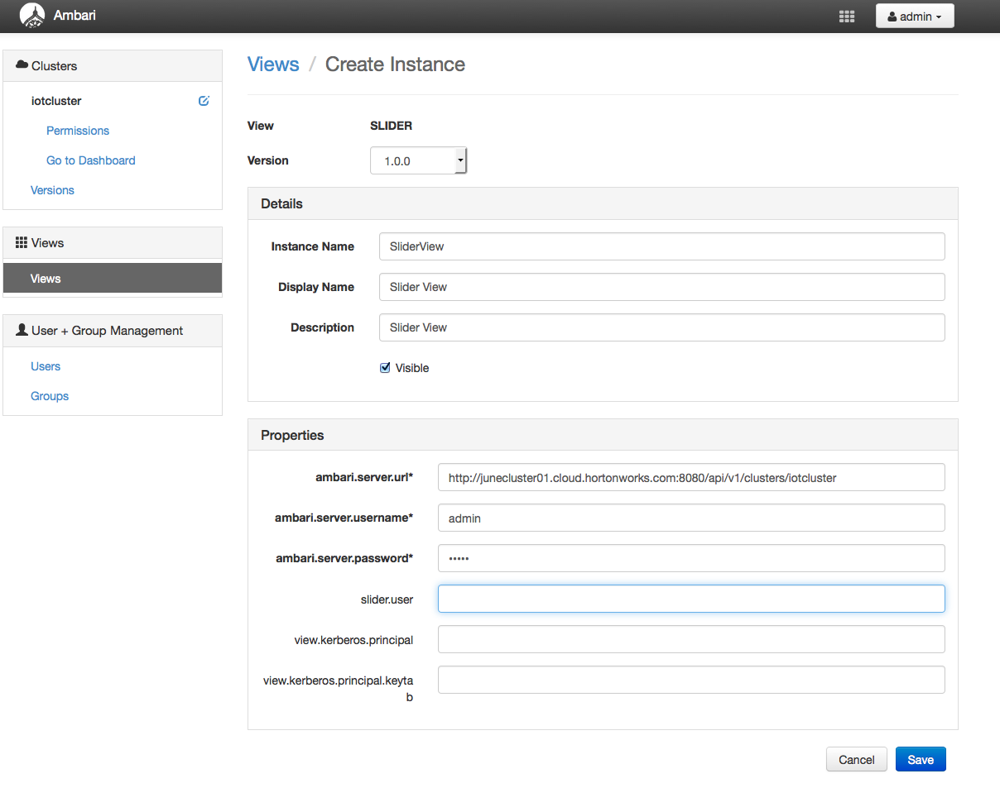
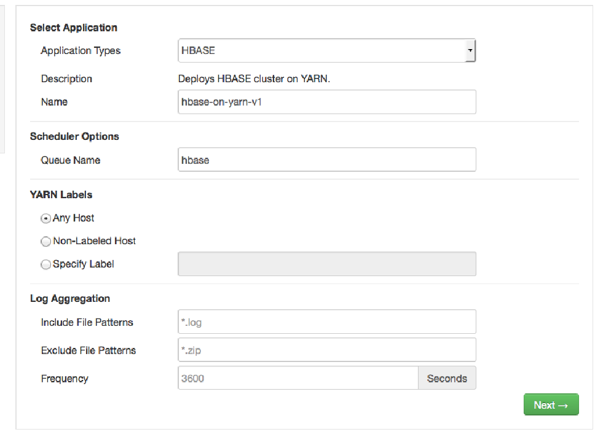
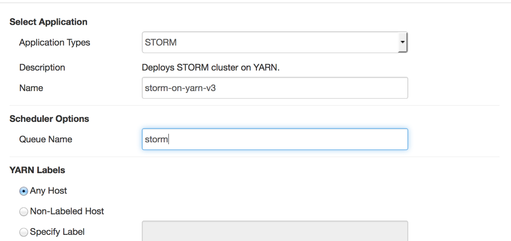
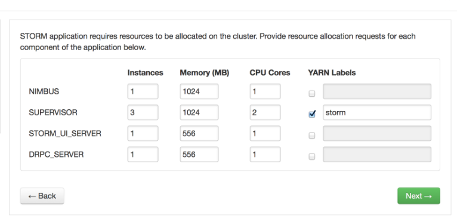
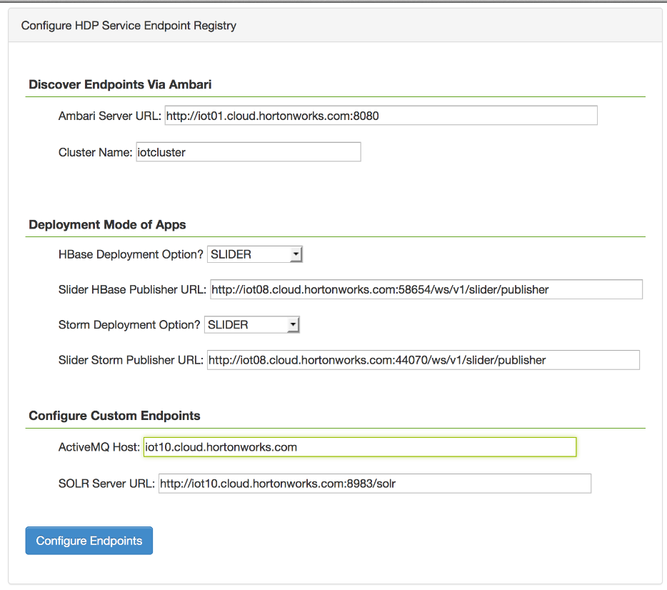
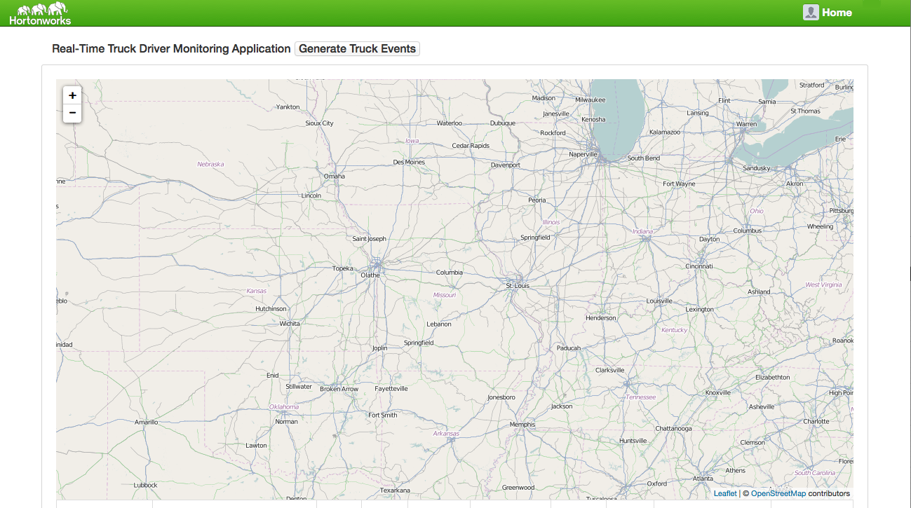

# IOT Trucking Reference Application
This project is meant to be a reference application/assembly for an IOT use case. The project consists of 5 projects:

1. **trucking-data-simulator** - Data simulator that allows you spin N number of Trucks emitting X number of events
2. **trucking-domain-objects** - Common trucking domain objects used across projects
3. **trucking-storm-topology** - Storm Topology to process trucking events in realtime
4. **trucking-env-setup** - Set of scripts to setup the cluster
5. **trucking-web-portal** - A web application that allows you to deploy the storm topoloyg and tap into the real-time trucking data using websockets from Active/MQ and Storm

## Business Use Case Setup

* Sensor devices from trucks captures events of the trucks and actions of the Driver.
* Some of these driver events are dangerous "events” such as: Lane Departure, Unsafe following distance, Unsafe tail distance
* The Business Requirement is to stream these events in, filter on violations and do real-time alerting when “lots” of erratic behavior is detected for a given driver over a short period of time.

## What does this Reference Application Demonstrate
* Stream Processing
* Search/Indexing
* Interactive Query
* Real-time CRUD
* Data Science
* Platform Capabilities including Multi-Tenancy, Security, Data Pipelines, and LIneage/Users/gvetticaden/Dropbox/Hortonworks/Development/Git/hdp/reference-apps/iot-trucking-app/README.md

## IOT Trucking App Storm Architecture 

## Installing and Running the IOT Trucking App (Sliderized Apps)

### Cluster Setup
Ideally, to showcase all of the capabilities of the Platform, it is recommended that you have at least a 10 nodes with at atleast 7GB of memory and 2 virtual cores. 

There are two primary ways to spin up a cluster using Ambari:

1. Using [SequenceIQ Cloudbreak](http://sequenceiq.com/cloudbreak/)  to provision a cluster on Azure, AWS or Google Compute in a matter of minutes. To provision a cluster using Cloudbreak, see [CloudBreak Github](https://github.com/sequenceiq/cloudbreak)
2. Using [Ambari 2.X automated installer](http://docs.hortonworks.com/HDPDocuments/Ambari-2.0.0.0/bk_Installing_HDP_AMB/content/ch_Getting_Ready.html) 
   

Regardless of whatever approach is chosen to provision a cluster, ensure the following during cluster setup and post install:

1. Via Ambari, install all Services except for HBase and Storm. We will be provisioning HBase and Storm via Slider so it is managed via Yarn/Slider
2. Install all the clients on at least one of the nodes.

A common out of the box approach to assign masters and slaves to a 8 node cluster is the following

### Set up the Maven Projects and setup scripts

1. SSH into an edge node
2. Create Few Directories 
    * mkdir workspace
    * cd workpace
    * mkdir lib
2. Setup JDK
	* Ensure that JDK 1.7 is installed
	* Setup the JAVA_HOME variable 
		* e.g: export JAVA_HOME=/usr/jdk64/jdk1.7.0_67
	
3. Install git
	* yum install git
4. Install Python3
	* cd workspace/lib
	* Follow [Install Python 3](http://www.shayanderson.com/linux/install-python-3-on-centos-6-server.htm)
4. Install Maven 3.0.5
	* cd workspace/lib
	* wget ftp://mirror.reverse.net/pub/apache/maven/maven-3/3.0.5/binaries/apache-maven-3.0.5-bin.tar.gz
	* tar -zxvf apache-maven-3.0.5-bin.tar.gz 
	* Create a link to mvn for easy executable: 
		* ln -s workspace/lib/apache-maven-3.0.5/bin/mvn /usr/bin/mvn
5. Install NPM, grunt
	* yum install npm
	* npm install -g grunt-cli
	* npm install bower -g
6. Setup the Follwoing PATH vars
	* export JAVA_HOME=/usr/lib/jvm/jre-1.7.0-openjdk.x86_64
     export M2_HOME=/mnt/apache-maven-3.2.1
     export PATH=${M2_HOME}/bin:${PATH}
7. Clone the Repo: 
	* cd workspace
	* git clone https://georgevetticaden@github.com/georgevetticaden/hdp.git

### Node Label Assignment
Node Labels provides the ability to run certain workloads on certain set of nodes on the cluster. This might be useful when you want to carve out certain nodes for certain workloads that require certain set of resources. In this reference application, we are going create node labels for storm and hbase so that these long running services are scheduled on only certain set of nodes.  

We will be creating 2 node labels called "hbase" and "storm" and then assign them each to 2 seperate nodes in our 8 node cluster. It will look somethign like the following:

The following walks you through how to do this:

1. Read through the following documentation [Configuring Nodel Labels](http://docs.hortonworks.com/HDPDocuments/HDP2/HDP-2.2.4/bk_yarn_resource_mgt/content/ref-7302fe4c-1e7c-4d32-9c62-18b9809d6fd1.1.html)
2. Setup Node Labels Directories (Execute teh following as root)
	* cd workspace/hdp/reference-apps/iot-trucking-app/trucking-env-setup/environment/prod/setup/labels
	* [./nodeLabelsSetup.sh](https://github.com/georgevetticaden/hdp/blob/master/reference-apps/iot-trucking-app/trucking-env-setup/environment/prod/setup/labels/nodeLabelsSetup.sh)
3. In Ambari, make the following Yarn config changes (under 'Advanced yarn-site' tab) and restart the YARN service:
	* yarn.node-labels.manager-class=org.apache.hadoop.yarn.server.resourcemanager.nodelabels.RMNodeLabelsManager
	* yarn.node-labels.fs-store.root-dir=hdfs://YOUR_FQDN_NN_HOST:8020/yarn/node-labels
4. Create Node Labels and assign each of the 2 node labels to 2 seperate hosts on your cluster
	* cd workspace/hdp/reference-apps/iot-trucking-app/trucking-env-setup/environment/prod/setup/labels
	* Edit file [nodeLabelCreationAndAssignment.sh](https://github.com/georgevetticaden/hdp/blob/master/reference-apps/iot-trucking-app/trucking-env-setup/environment/prod/setup/labels/nodeLabelCreationAndAssignment.sh) and modify the host names to the relative ones in your cluster.
	* [./nodeLabelCreationAndAssignment.sh](https://github.com/georgevetticaden/hdp/blob/master/reference-apps/iot-trucking-app/trucking-env-setup/environment/prod/setup/labels/nodeLabelCreationAndAssignment.sh)

5. Verify Node Lables were assigned to the nodes
	* yarn node -list
    * yarn node -status <Node_ID>

### Configure Capacity Scheduler Queues
The default scheduler within HDP Yarn is the Capacity Scheduler. Capacity Scheduler has the notion of queues that allows you to carve up the resources of the clusters to different applications or business units. Two powerful capabilities of the capacity scheduler that we will use are teh following:

1. [Hierarchal Queues](http://docs.hortonworks.com/HDPDocuments/HDP2/HDP-2.2.4/bk_yarn_resource_mgt/content/ref-4e3db754-a63c-42ff-b3d4-d808b4381fd2.1.html)
	* Ensure resources are shared among the sub-queues of an organization before other queues are allowed to use free resources, there-by providing affinity for sharing free resources among applications of a given organization
2. [Assign Node Labels to Queues](http://docs.hortonworks.com/HDPDocuments/HDP2/HDP-2.2.4/bk_yarn_resource_mgt/content/ref-7302fe4c-1e7c-4d32-9c62-18b9809d6fd1.1.html) 
 	* By assigning node labels to a certain queue, then any job that gets submitted to that queue will only be scheduled on the nodes with that label.

The below pic describes how we will configure the queues. Note that only leaf queues will have jobs submitted to it. All Data science jobs will the submitted to teh Data Science queue which will have 10% of the cluster. 90% of the cluster will be given to parent queue called Prod. Under Prod, there are 4 Queues:

1. HBase
	* Has label called hbase which is allocated 100%. This means that when a job gets submitted to this queue with label hbase, then it has access to 100% of the resources on the nodes with label hbase. So in our case 100% of resoruces of Node 4 and Node 5. As we will see when create an HBase slider App, Hbase components like the regions servers will be submitted to this queue with label HBase. 
	* Has label called nolabel which is allocated 20% of 75% of the cluster. This means that when a job gets submitted to this queue with no label assignment, then it will be allocated 15% of resources across all nodes with no label. So in our case, it will have access to 15% of the resources across Nodes 1,2,3 and 8. As we will see when create an HBase slider App, Hbase components like the Hbase Master will be submitted to this queue with no label
2. Storm
	* Configured Similar to HBase
3. Reporting
	* Any reporting/hive queries will use this queue which has 10% of 75% of the cluster resources with no label
4. ETL
	* Any falcon/oozie etl jobs will be submitted to this queue which has 50% of the 75% of the cluster resources with no label

The following are the steps to configure the CS Queues as described above.

1. Read  through [Configuring Capacity Scheduler](http://docs.hortonworks.com/HDPDocuments/HDP2/HDP-2.2.4/bk_yarn_resource_mgt/content/ch_capacity_scheduler.html).
2. cd workspace/hdp/reference-apps/iot-trucking-app/trucking-env-setup/environment/prod/setup
3. modify the [config.properties](https://github.com/georgevetticaden/hdp/blob/master/reference-apps/iot-trucking-app/trucking-env-setup/environment/prod/setup/config.properties) to configure the ambari host and credentials. We will be use the rest API to update the capacity scheduler config
4. cd workspace/hdp/reference-apps/iot-trucking-app/trucking-env-setup/environment/prod/setup/queue
5. edit [main_updateCSQueue.py](https://github.com/georgevetticaden/hdp/tree/master/reference-apps/iot-trucking-app/trucking-env-setup/environment/prod/setup/queue) and make sure sys.path.insert 2 arg is pointing to the right path
6. Call the python script that configure the capacity scheduler queue via Ambari APIs:
	* python3 main_updateCSQueue.py 
7. Update the the following yarn config property (in scheduler stab)and restart the Yarn service
	* yarn.scheduler.minimum-allocation-mb = 682	

### Slider Setup

##### 1. Install the Slider View

1. Click on Admin Tab --> Manage Ambari
2. Click Deploy View --> Click Slider --> Create Instance
3. Configure the View With your cluster details

##### 2. Install the HBase and Storm Slider Libraries into Ambari
1. Login to the Ambari Host as ro2. . 
2. Execute the commands in the script [Setup Slider](https://github.com/georgevetticaden/hdp/blob/master/reference-apps/iot-trucking-app/trucking-env-setup/environment/prod/setup/slider/main_setupSlider.sh) 

### Create an Instance of the HBase Slider App
Now That we have configured node labels and carved up the resources of our clsuter using the Capacity Scheduler, it is now to create an instance of the HBase app managed by Yarn. 

Go the Slider View --> Create App
##### 1.  Select Type
Select HBASE App type, provide name, configure the queue name as "hbase" and configure yarn labels as any host

##### 2.  Select Allocate Resources

##### 3.  Configuration

Leave the Defaults
##### 4.  Deploy

Clikc Deploy

#### Create an Instance of the Storm Slider App

Go the Slider View --> Create App
##### 1.  Select Type
Select HBASE App type, provide name, configure the queue name as "hbase" and configure yarn labels as any host

##### 2.  Select Allocate Resources

##### 3.  Configuration

Leave the Defaults
##### 4.  Deploy

Clikc Deploy

### Configure HDFS
We will now create the HDFS directory that will be the staging area for all new truck events. The HDFS Storm Bolt will store all raw events into this directory initially 

1. Log into the edge node where you downloaded the code as root
2. cd workspace/hdp/reference-apps/iot-trucking-app/trucking-env-setup/environment/prod/setup/hdfs
3. [./createDirsInHDFS.sh](https://github.com/georgevetticaden/hdp/blob/master/reference-apps/iot-trucking-app/trucking-env-setup/environment/prod/setup/hdfs/createDirsInHDFS.sh)

### Configure Hive
Les now create the hive tables used to store the trucking daa for long term. The first stage will be a staging table in Text formant and the second table with be the same table but stored with the file optimized format called ORC

Do the following on the edge Node

1. Log into the edge node where you downloaded the code as root
2. cd workspace/hdp/reference-apps/iot-trucking-app/trucking-env-setup/environment/prod/setup/hive
3. [./setupHive.sh](https://github.com/georgevetticaden/hdp/blob/master/reference-apps/iot-trucking-app/trucking-env-setup/environment/prod/setup/hive/setupHive.sh)

### Configure HBase
We will now create all the necessary HBase tables required by the application. 
We need to to find a a node where slider has spun up an hbase component so we can use the hbase client to create the necessary HBase Tables for the application

1. Go the the Application Master of the HBase Slider App 
	* Go the Slider View --> Click the Hbase App --> Quick Links --> Yarn Application --> HBase Application Master
2. On the AppMaster Page, find the details of the HBaseMaster Host and container which look somethign like the following:
	* HBASE_MASTER Host(s)/Container(s): [iot09.cloud.hortonworks.com/container_e02_1432858569861_0003_01_000002] 
3. SSH as root into the HBase master host (e.g: iot09.cloud.hortonworks.com )
4. cd into the direcotry where you have have cofigured the yarn property yarn.nodemanager.local-dirs (e.g: /mnt/hadoop/yarn/local)
5. From there: cd usercache/yarn/appcache/[container_info_you_found_in_step_2]/[container_info_you_found_in_step_2]/app/install/hbase-0.98.4.2.2.0.0-2041-hadoop2/bin
6. ./hbase shell
7. Execute the hbase table creation commands found here: 
	* [createHBaseTables](https://github.com/georgevetticaden/hdp/blob/master/reference-apps/iot-trucking-app/trucking-env-setup/environment/prod/setup/hbase/createHBaseTables)
8. This should have created 3 tables in Hbase
	1. driver_dangerous_events --> stores every violation event
	2. driver_dangerous_events_count --> running count of violations per driver
	3. driver_events --> all events generated by trucks and drivers
9. Verify these tables were creating by running the following in hbase shell:
	* list tables 

### Configure Kafka
Create the Kafka Topic required by the application:

1. In Ambari, find a node where a Kafka Broker is running. SSH into that node as root
2. cd /usr/hdp/current/kafka-broker/bin
3. Run the following command to create a kafka topic (make sure to replace with your own zookeeperhost:host that the kafka broker is using):
	* ./kafka-topics.sh --create --zookeeper [your_zookeeper_host]:2181 --replication-factor 1 --partition 5 --topic truck_events 
4. Verify the topic got created by running the following:
	* ./kafka-topics.sh --list --zookeeper [your_zookeeper_host]:2181  

### Install & Configure SOLR 4.10

##### Install Solr (Single Node)
1. Read through [Solr Ref Guide](https://archive.apache.org/dist/lucene/solr/ref-guide/apache-solr-ref-guide-4.10.pdf) to get an understanding of what we will be doing below. 
2. Log into the edge node where you installed the Maven Projects in the earlier step as root
3. cd workspace 
4. mkdir solr
5. adduser solr
6. passwd solr
7. chown solr:solr solr
8. su solr
9. cd workspace/solr
10. wget http://archive.apache.org/dist/lucene/solr/4.10.0/solr-4.10.0.tgz
11. tar -zxvf solr-4.10.0.tgz
12. cd solr-4.10.0/example/
13. Run Solr once to test out of the box solr is working
	* Make sure Java 1.7 is installed and you setup JAVA_HOME env variable like:
		* export JAVA_HOME=/usr/jdk64/jdk1.7.0_67
		* $JAVA_HOME/bin/java -jar start.jar
	* Go to your browser and hit the Solr admin url: [SOLR_HOS]:8983/solr/
	* Verify the Solr Admin Console comes up
	* go back to your terminal and do a "ctrc"" c to to stop the solr jetty process
			

		
##### Install &  Configure Banana
We are going to install [Banana Web App](https://github.com/LucidWorks/banana) within the existing Sorl Instance.

1. Read Through [Banana README](https://github.com/LucidWorks/banana) to get a understand of what we be doing below
2. su solr
3. cd workspace/solr
4. wget https://github.com/LucidWorks/banana/archive/v1.5.0.tar.gz
5. tar -zxvf v1.5.0.tar.gz 
6. cd banana-1.5.0/
7. Configure Banana to point to where Solr is running:
	* vi src/config.js and configure the proeprty "solr"" to your solr host
		* e.g: solr: "http://iot10.cloud.hortonworks.com:8983/solr/"
	* vi vi src/app/dashboards/default.json and modify the "server" property to the solr host
		* e.g: "server": "http://iot10.cloud.hortonworks.com:8983/solr/"
8. Copy the banana web app into the solr jetty instance
	* cd workspace/solr
	* cp -R  banana-1.5.0/ solr-4.10.0/example/solr-webapp/webapp/
10. Start Solr and Verify you can access the Banana dashboard
	* cd workspace/solr/solr-4.10.0/example
	* $JAVA_HOME/bin/java -jar start.jar
	* Go to your browser and hit the Solr admin url: [SOLR_HOST]:8983/solr/banana-1.5.0/src/index.html#/dashboard
	* Verify the dashboard comes up
	* Go back to your terminal and do a "ctrc c" to to stop the solr jetty process
	

##### Configure Banana to to Store Dashboards in Solr
The below set of steps allows you to save and load banana dashbaords from Solr.

1. cd workspace/solr
2. Copy the banana collection config into solr
	* cp -R  banana-1.5.0/resources/banana-int-solr-4.5/banana-int/ solr-4.10.0/example/solr/
3. Start Solr
	* cd workspace/solr/solr-4.10.0/example/
	* $JAVA_HOME/bin/java -jar start.jar
4. Create a new Solr Core/Collection for Banana to Save dashboards
	* Go the Solr Admin Console: [SOLR_HOS]:8983/solr/
	* Click on ""Core Admin" Tab on the left and you should see the banana-int core
	* Go back to your terminal and do a "ctr c" c to to stop the solr jetty process
	
	
##### Configure Solr to index Trucking Event Data
Lets now configure solr to be able to index trucking event data by adding a new collection and a schema

1. Create a new core/collection for trucking event data from an existing example core:
	* cd workspace/solr/solr-4.10.0/example/solr
	* mkdir truck_event_logs
	* cp -ra workspace/solr/solr-4.10.0/example/solr/collection1/conf/ workspace/solr/solr-4.10.0/example/solr/truck_event_logs/conf

2. Replace the example's schema.xml with the schema.xml for trucking events
	* cd workspace/solr/solr-4.10.0/example/solr/truck_event_logs/conf
	* rm -fr schema.xml
	* copy the contents of this [schema.xml](https://github.com/georgevetticaden/hdp/blob/master/reference-apps/iot-trucking-app/trucking-env-setup/environment/prod/setup/solr/schema.xml) into new schema.xml in that directory
	
3. Add new solr core called truck-event-data via the Solr Admin
	* Start up Solr Server as a background process
		* cd workspace/solr/solr-4.10.0/example/
		* nohup $JAVA_HOME/bin/java -jar start.jar &
	* Add new Core
		* Go the Solr Admin Console: [SOLR_HOS]:8983/solr/
		* Click on ""Core Admin" Tab  --> Select "Add Core"
		* Configure the core as the following:
			* name = truck_event_logs
			* instanceDir = /[REPLACE_WITH_YOUR_BASE_DIR]/workspace/solr/solr-4.10.0/example/solr/truck_event_logs
			* dataDir = data
			* config = solrconfig.xml
			* schem = schema.xml
		* Select "Add Core" and you should see a new core claled truck_event_logs
		
4. Leave the solr server process running in the backgroud.
	* If for some reason you need to kill it, do the following:
		* ps -ef | grep solr
		* kill <process_id>
		
	
### Install & Configure ActiveMQ 5.9.8
ActiveMQ is required for the Storm Topology to push alerts to and for the trucking-web-portal's websocket connection to show driver events in real-time
Do the following the edge Node:

##### Install ActiveMQ
1. Log into the node where you installed the Maven Projects in the earlier step as root
2. cd workspace
3. mkdir activemq
4. cd activemq
5. wget http://archive.apache.org/dist/activemq/apache-activemq/5.9.0/apache-activemq-5.9.0-bin.tar.gz
2. tar -zxvf apache-activemq-5.9.0-bin.tar.gz

##### Configur and Start ActiveMQ
1. cd workspace/activemq/apache-activemq-5.9.0/conf
2. Replace the activemq.xml file with this [activemq.xml](https://github.com/georgevetticaden/hdp/blob/master/reference-apps/iot-trucking-app/trucking-env-setup/environment/prod/setup/activemq/activemq.xml). 
3. Start ActiveMQ with this config
	* cd workspace/activemq/apache-activemq-5.9.0/bin
	* ./activemq start xbean:file:workspace/activemq/apache-activemq-5.9.0/conf/activemq.xml
4. Verify it is up by running:
	* activemq/apache-activemq-5.9.0/bin/activemq status
	* Hit the activeMQ console (credentials: admin/admin): 
		e.g:  http://[REPlACE_WITH_HOSTNAME]:8161/admin/topics.jsp
5. Leave ActiveMQ running

### Build and Run The IOT Web Portal Application
The trucking web portal is the front end app to the trucking IOT application that does the following:

1. Deploys the storm topology to the storm cluster
2. Generate streams of trucking data from different trucks
3. Renders a map with the real-time trucking data that is flowing through STorm and into HBase. 

#####  Build and Configure the IOT Web Portal
Log into the node where you installed the Maven Projects in the earlier step as root

1. cd workspace/hdp/app-utils/hdp-app-utils
2. Setup the JAVA_HOME variable
	* export JAVA_HOME=/usr/jdk64/jdk1.7.0_67
2. mvn clean install -DskipTests=true
	* This will build set of hdp app utilities required for the iot-trucking app
3. cd workspace/hdp/iot…
4.  mvn clean install -DskipTests=true
	* This will build all the related projects associated the iot app
5. cd workspace/hdp/reference-apps/iot-trucking-app/trucking-web-portal 
4. sudo bower --allow-root update
5. Edit properites file for the app:
	* cd /mnt/workspace/hdp/reference-apps/iot-trucking-app/trucking-web-portal/src/main/resources/config/dev/registry
	* Open file called ref-app-hdp-service-config.properties and configure the following properties:
		* trucking.activemq.host --> set this to the host where you installed and running activemq
		* trucking.notification.topic.connection.url --> replace the host with the host for your activemq instance
		* trucking.storm.topology.jar --> change this ot the location of the local maven repo where you installed the storm topology 			* (e.g: /root/.m2/repository/hortonworks/hdp/refapp/trucking/trucking-storm-topology/3.0.0-SNAPSHOT/trucking-storm-topology-3.0.0-SNAPSHOT-shaded.jar)
)

#####  Start the IOT Web Portal Application Server

1. cd workspace/hdp/reference-apps/iot-trucking-app
2. Ensure that you set JAVA_HOME env variable to a 1.7:
	* e.g: export JAVA_HOME=/usr/jdk64/jdk1.7.0_67
3. mvn clean install -DskipTests=true
	* Build will take a few minutes. This will build all the components for the iot-trucking-app
4. cd trucking-web-portal
5. Run the following command to start the portal jetty server. Replace the activemq host var with your host
	* nohup mvn jetty:run -X -Dservice.registry.config.location=[REPLACE_WITH_DIR_YOU_CLONED_TO]/workspace/hdp/reference-apps/iot-trucking-app/trucking-web-portal/src/main/resources/config/dev/registry -Dtrucking.activemq.host=[REPLACE_WITH_THE_FQDN_OF_ACTIVEMQ_HOST] &

##### Configure the Endpoints for the App, Generate Truck Events and View Real-time Alerts

1. Hit the portal URL: http://[edge_node_hostname]:8080/iot-trucking-app/ You should See this:

2. Click the link "Configure HDP Service Endpoints" to Configure the Application with HDP Service Endpoints:
	* Set the Following properties:
		* Ambari Server URL = the ambari server url with port
		* Cluster Name = the name you gave to the ambari cluster
		* Set HBase Deployment Option to defaulted as "Slider"
		* Slider HBase Publisher URL = Find this value by doing the following:
			* Log into Ambari --> Views --> Slider Views --> Select HBase Slider View
			* Quick Links --> Yarn Application --> Application Master
			* Search for the publisher URL. 
				* e.g:  http://iot08.cloud.hortonworks.com:58654/ws/v1/slider/publisher
			
	* 

12.Generate the Truck Event Streams

13.View Truck Alerts

