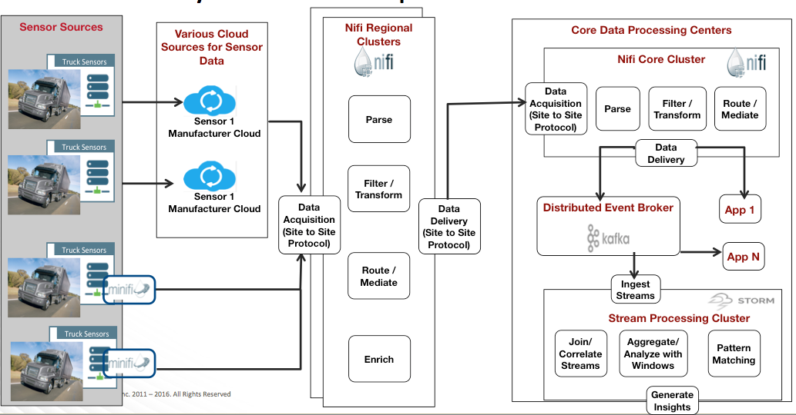
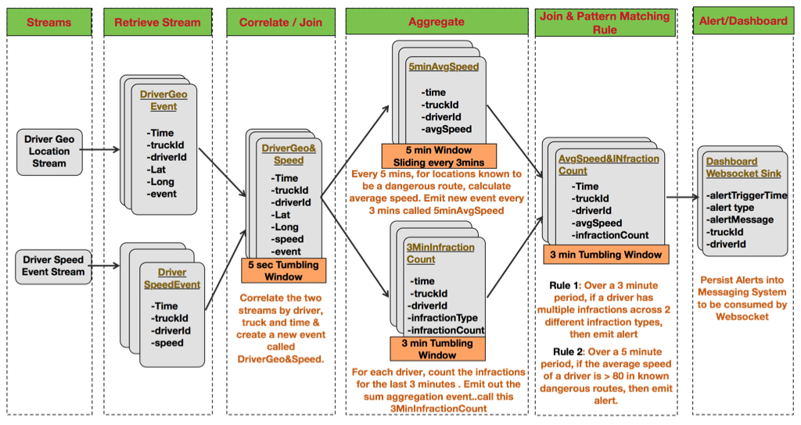
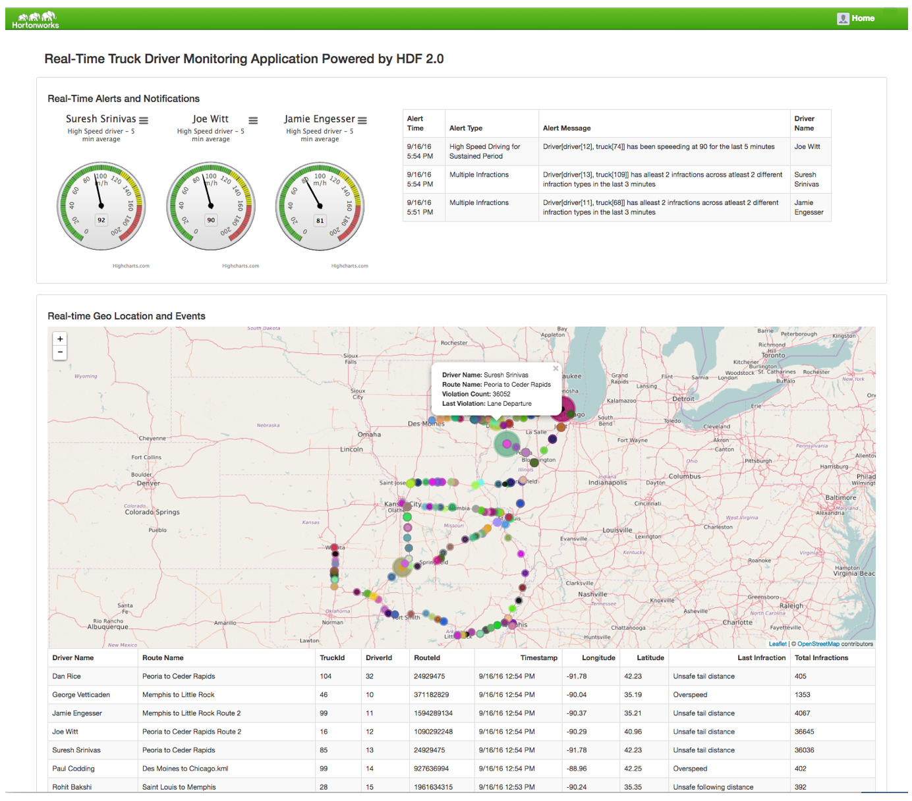
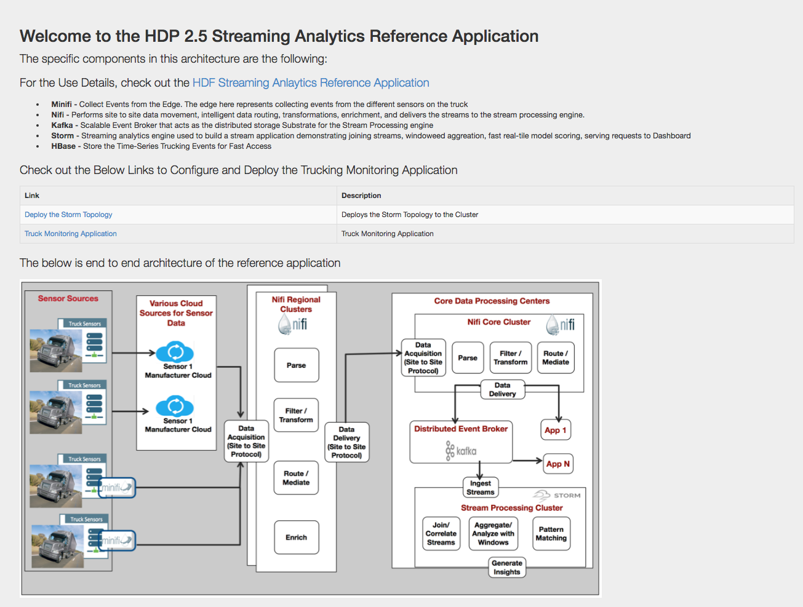

# HDF 2.0 Streaming Analytics Reference Application
This project is meant to be a reference application for the Hortonworks Data Flow Platform (HDF) The project consists of 5 projects:

1. **trucking-data-simulator** - Data simulator that allows you spin N number of Trucks emitting X number of events
2. **trucking-domain-objects** - Common trucking domain objects used across projects
3. **trucking-storm-topology** - Storm Topology to process trucking events in realtime
4. **trucking-env-setup** - Set of scripts to setup the cluster
5. **trucking-web-portal** - A web application that allows you to deploy the storm topoloyg and tap into the real-time trucking data using websockets from Active/MQ and Storm

## Business Use Case Setup

* Sensor devices from trucks captures events of the trucks and actions of the Driver.
* Some of these driver events are dangerous "events” such as: Lane Departure, Unsafe following distance, Unsafe tail distance
* The Business Requirement is to stream these events in, filter on violations and do real-time alerting when “lots” of erratic behavior is detected for a given driver over a short period of time.

## What does this Reference Application Demonstrate
* Stream Processing (HDF - Stream Processing)
* Aggregrations over Windows via Tumbling and Sliding (HDF - Stream Processing)
* Joining and Forking Streams (HDF - Stream Processing)
* Pattern Matching (HDF - Stream Processing)
* Collecting data from the Edge - First Mile Problem (HDF - Flow Management) - Coming Soon
* Data Acquisition, parsing, enrichment and intelligent routing (HDF - Flow Management) - Coming Soon
* Running the Reference Application on HDF 2.0 / HDP 2.5

## IOT Trucking App Reference Architecture 

## Stream Processing Logical Architecture

## Streaming Analtyics App Powered by HDF 2.0

## Installing and Running the IOT Trucking App on HDP 2.5 / HDF 2.0

9/16/2016 - THIS WILL BE UPDATED SOON - THE BELOW IS OUT OF DATE!!

### Cluster Setup
Install HDP 2.5 cluster using instructions here: http://docs.hortonworks.com/HDPDocuments/Ambari-2.4.0.1/bk_ambari-installation/content/index.html

### Set up the Maven Projects and setup scripts

1. SSH into an edge node
2. Create Few Directories 
    * mkdir workspace
    * cd workpace
    * mkdir lib
2. Setup JDK
	* Ensure that JDK 1.7 is installed
	* Setup the JAVA_HOME variable 
		* e.g: export JAVA_HOME=/usr/jdk64/jdk1.7.0_67
	
3. Install git
	* yum install git
4. Install Python3
	* cd workspace/lib
	* Follow [Install Python 3](http://www.shayanderson.com/linux/install-python-3-on-centos-6-server.htm)
4. Install Maven 3.0.5
	* cd workspace/lib
	* wget ftp://mirror.reverse.net/pub/apache/maven/maven-3/3.0.5/binaries/apache-maven-3.0.5-bin.tar.gz
	* tar -zxvf apache-maven-3.0.5-bin.tar.gz 
	* Create a link to mvn for easy executable: 
		* ln -s workspace/lib/apache-maven-3.0.5/bin/mvn /usr/bin/mvn
5. Install NPM, grunt
	* yum install npm
	* npm install -g grunt-cli
	* npm install bower -g
6. Setup the Follwoing PATH vars
	* export JAVA_HOME=/usr/lib/jvm/jre-1.7.0-openjdk.x86_64
     export M2_HOME=/mnt/apache-maven-3.2.1
     export PATH=${M2_HOME}/bin:${PATH}
7. Clone the Repo: 
	* cd workspace
	* git clone https://georgevetticaden@github.com/georgevetticaden/hdp.git

### Configure Kafka
Create the Kafka Topic required by the application:

1. In Ambari, find a node where a Kafka Broker is running. SSH into that node as root
2. cd /usr/hdp/current/kafka-broker/bin
3. Create 2 kafka topics.. one for geo events and another for truck speed events (replace with your own zookeeperhost:host that the kafka broker is using) :
	* ./kafka-topics.sh --create --zookeeper [your_zookeeper_host]:2181 --replication-factor 1 --partition 5 --topic truck_events 
	* ./kafka-topics.sh --create --zookeeper [your_zookeeper_host]:2181 --replication-factor 1 --partition 5 --topic truck_speed_events 
4. Verify the topic got created by running the following:
	* ./kafka-topics.sh --list --zookeeper [your_zookeeper_host]:2181  

		
	
### Install & Configure ActiveMQ 5.9.8
ActiveMQ is required for the Storm Topology to push alerts to and for the trucking-web-portal's websocket connection to show driver events in real-time
Do the following the edge Node:

##### Install ActiveMQ
1. Log into the node where you installed the Maven Projects in the earlier step as root
2. cd workspace
3. mkdir activemq
4. cd activemq
5. wget http://archive.apache.org/dist/activemq/apache-activemq/5.9.0/apache-activemq-5.9.0-bin.tar.gz
2. tar -zxvf apache-activemq-5.9.0-bin.tar.gz

##### Configur and Start ActiveMQ
1. cd workspace/activemq/apache-activemq-5.9.0/conf
2. Replace the activemq.xml file with this [activemq.xml](https://github.com/georgevetticaden/hdp/blob/master/reference-apps/iot-trucking-app/trucking-env-setup/environment/prod/setup/activemq/activemq.xml). 
3. Start ActiveMQ with this config
	* cd workspace/activemq/apache-activemq-5.9.0/bin
	* ./activemq start xbean:file:workspace/activemq/apache-activemq-5.9.0/conf/activemq.xml
4. Verify it is up by running:
	* activemq/apache-activemq-5.9.0/bin/activemq status
	* Hit the activeMQ console (credentials: admin/admin): 
		e.g:  http://[REPlACE_WITH_HOSTNAME]:8161/admin/topics.jsp
5. Leave ActiveMQ running

### Configure HBase

HBase is not part of HDF 2.0 Stack. Hence you have spin up an HDP 2.5 cluster with HBase service or spin up just an Hbase cluster. To spin up HDP 2.5 cluster, see the instructiosn here: http://docs.hortonworks.com/HDPDocuments/Ambari-2.4.1.0/bk_ambari-installation/content/index.html

After installign an HBase cluster, log into a node with the hbase client and do the following:

1. Execute the hbase table creation commands found here: 
	[createHBaseTables](https://github.com/georgevetticaden/hdp/blob/master/reference-apps/iot-trucking-app/trucking-env-setup/environment/prod/setup/hbase/createHBaseTables)
2. This will create the following Hbase tables
	* driver_dangerous_events --> stores every violation event
	* driver_dangerous_events_count --> running count of violations per driver
	* driver_events --> all events generated by trucks and drivers
3. Verify these tables were creating by running the following in hbase shell:
	* list tables 

### Build and Run The IOT Web Portal Application
The trucking web portal is the front end app to the trucking IOT application that does the following:

1. Deploys the storm topology to the storm cluster
2. Generate streams of trucking data from different trucks
3. Renders a map with the real-time trucking data that is flowing through STorm and into HBase. 

#####  Build and Configure the IOT Web Portal
Log into the node where you installed the Maven Projects in the earlier step as root

1. cd workspace/hdp/app-utils/hdp-app-utils
2. Setup the JAVA_HOME variable
	* export JAVA_HOME=/usr/jdk64/jdk1.7.0_67
2. mvn clean install -DskipTests=true
	* This will build set of hdp app utilities required for the iot-trucking app
3. cd workspace/hdp/iot…
4.  mvn clean install -DskipTests=true
	* This will build all the related projects associated the iot app
5. cd workspace/hdp/reference-apps/iot-trucking-app/trucking-web-portal 
4. sudo bower --allow-root update
5. Edit properites file for the app:
	* cd /mnt/workspace/hdp/reference-apps/iot-trucking-app/trucking-web-portal/src/main/resources/config/dev/registry
	* Open file called ref-app-hdp-service-config.properties and configure the following properties:
		* ambari.cluster.name --> the name of your HDF cluster
		* ambari.server.url --> Ambari server url (e.g: http://hdf-ref-app0.field.hortonworks.com:8080/)
		* hbase.zookeeper.host --> the zookeeper host that hbase uses.
		* trucking.activemq.host --> set this to the host where you installed and running activemq
		* trucking.notification.topic.connection.url --> replace the host with the host for your activemq instance
		* trucking.storm.topology.jar --> change this ot the location of the local maven repo where you installed the storm topology 			* (e.g: /root/.m2/repository/hortonworks/hdp/refapp/trucking/trucking-storm-topology/3.0.0-SNAPSHOT/trucking-storm-topology-3.0.0-SNAPSHOT-shaded.jar)
)

#####  Start the IOT Web Portal Application Server

1. cd workspace/hdp/reference-apps/iot-trucking-app
2. Ensure that you set JAVA_HOME env variable to a 1.7:
	* e.g: export JAVA_HOME=/usr/jdk64/jdk1.7.0_67
3. mvn clean install -DskipTests=true
	* Build will take a few minutes. This will build all the components for the iot-trucking-app
4. cd trucking-web-portal
5. Run the following command to start the portal jetty server. Replace the activemq host var with your host
	* nohup mvn jetty:run -X -Dservice.registry.config.location=[REPLACE_WITH_DIR_YOU_CLONED_TO]/workspace/hdp/reference-apps/iot-trucking-app/trucking-web-portal/src/main/resources/config/dev/registry -Dtrucking.activemq.host=[REPLACE_WITH_THE_FQDN_OF_ACTIVEMQ_HOST] &

##### Configure the Endpoints for the App, Generate Truck Events and View Real-time Alerts

1. Hit the portal URL: http://[edge_node_hostname]:8080/iot-trucking-app/ You should See this:

2. Deploy the Storm Topology
	* Click the Home Button
	* Click the "Deploy the Storm Toplogy" link. This will take a few minutes but it will deploy the storm Topology to the storm framework on the cluster
	
3. Generate The Truck Event Streams
	* Click the "Truck Monitoring Application" Link
	* After the page renders and initializes (about 15 seconds), the "Generate Truck Events" button will be enabled and then click it

4. View Real-time trucking data
	* You should now start to see the real-time trucking data and alerts on the map.
	* See pic below for an example:

