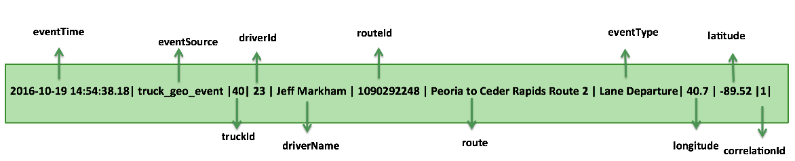
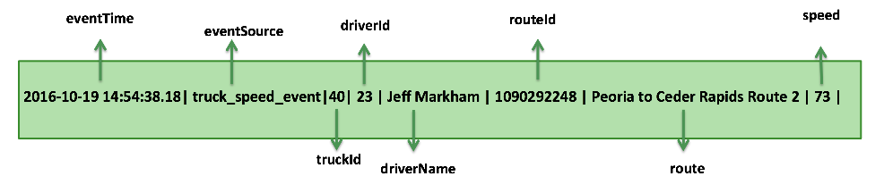

# Trucking Data Simulator


## About the Simulator
The trucking data simulator allows you to do the following:

* Generate streaming events for different sensors on a truck  
* Control the number of trucks/drivers on the road
* Control the number of events generated by each truck
* Use real trucking routes with real lat/long locations for the truck
* Control the output of the event (csv, json)
* Control what metadata goes into the event (schema metadata)
* Control where the event is generated (in a file, as an event into Kafka)


Out of the box, it supports two event types representing 2 different sesnsors that would be on a truck:

* Truck Geo Event

	* Sample Raw Event:    

``` 

2016-10-19 14:54:38.18|truck_geo_event|40|23|Jeff Markham|1090292248|Peoria to Ceder Rapids Route 2|Normal|40.7|-89.52|1| 

````




* Truck Speed Event
 
``` 

2016-10-19 14:54:38.197|truck_speed_event|40|23|Jeff Markham|1090292248|Peoria to Ceder Rapids Route 2|73|

````



### Building the Simulator

#### Pre-requisites
1. Java 8
2. setup your JAVA_HOME to point to java 8
3. Put JAVA_HOME on your PATH
4. Install Maven
5. Put Maven on your PATH
4. Git


#### Build the Simulator
1.  Build schema registry which is a dependency

``` 
git clone https://github.com/hortonworks/registry.git
cd registry
mvn clean install -DskipTests=true
``` 

2. Clone the repo and the build the libraries
	
``` 
git clone https://github.com/georgevetticaden/hdp.git
cd hdp/app-utils/hdp-app-utils/
mvn clean install -DskipTests=true
cd ../hdp-app-utils/../../reference-apps/iot-trucking-app/
mvn clean install -DskipTests=true
``` 
3. s


### Run the Simulator

By default each simulator will spin up about 11 Trucks and assign a driver and route to it. 
The different args pssed to  the hortonworks.hdp.refapp.trucking.simulator.SimulationRunnerApp allow different ways to generate the event and where to store the event. The following describes the different args to pass in:

* arg 0
	* the number of events you want each truck to emit (-1 means emit infinite number of events)
* arg 1
	* Domain Object (class of the domain object. set it to: "hortonworks.hdp.refapp.trucking.simulator.impl.domain.transport.Truck")
* arg 2
	* Event Collector (class of the event collector which outputs the event in different formats (csv, json) and different locations (file, kafka) ). E.g: hortonworks.hdp.refapp.trucking.simulator.impl.collectors.KafkaEventCollector
* arg 3 
	* demoId (always set to 1)
* arg 4	
	* the directory where the the different routes are located (e.g: [root_dir_of_ref_app]/hdp/reference-apps/iot-trucking-app/trucking-web-portal/src/main/resources/routes/midwest)
* arg 5
	* a delay (in millisconds) between every event that a given truck generates events (e.g: 500)
* arg 6
    * output location of the event (kafka broker url for kafka, file name if outputing to file)
    
    
#### Example 1: Generate Event to Kafka Topic


