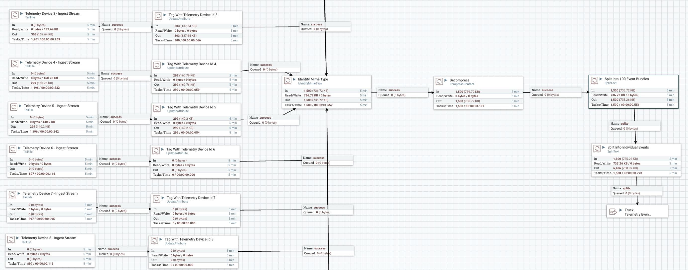
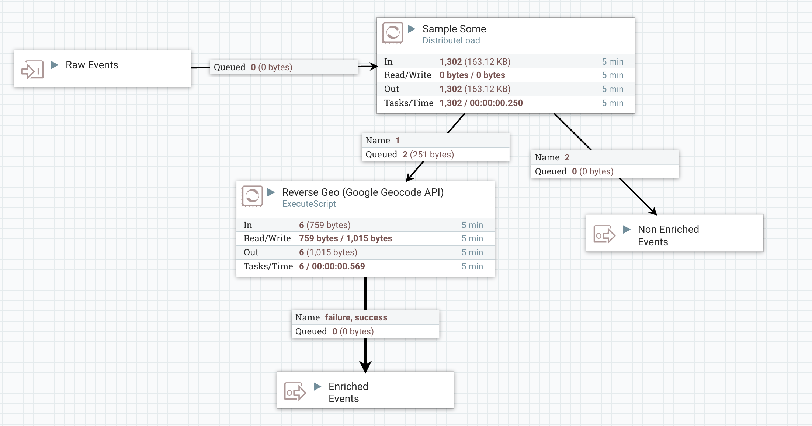
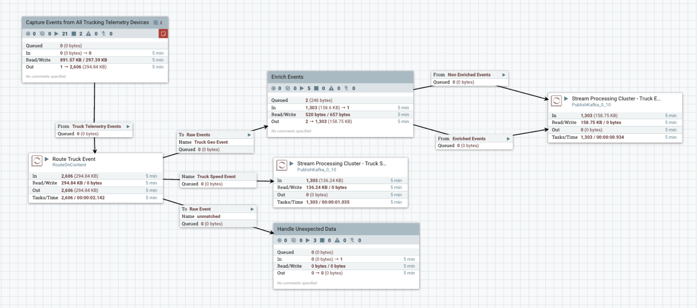

# Flow Management with Nifi
The Nifi component is used to do all the flow management tasks of the reference application which includes:

* Acquiring the events from edge. In this case acquiring dataing from trucks that emit events into files
* Tagging the event with metadata 
* Encrypting and decrypting events
* Routing the event based on content (routing based on the event source)
* Enriching the event (e.g: reverse geo code lookup)
* Delivering the event (delivering the data to a Kafka topic)

## Acquisition of Data

## Enrichment of Data

## Route, Transformation and Delivering of the Data

