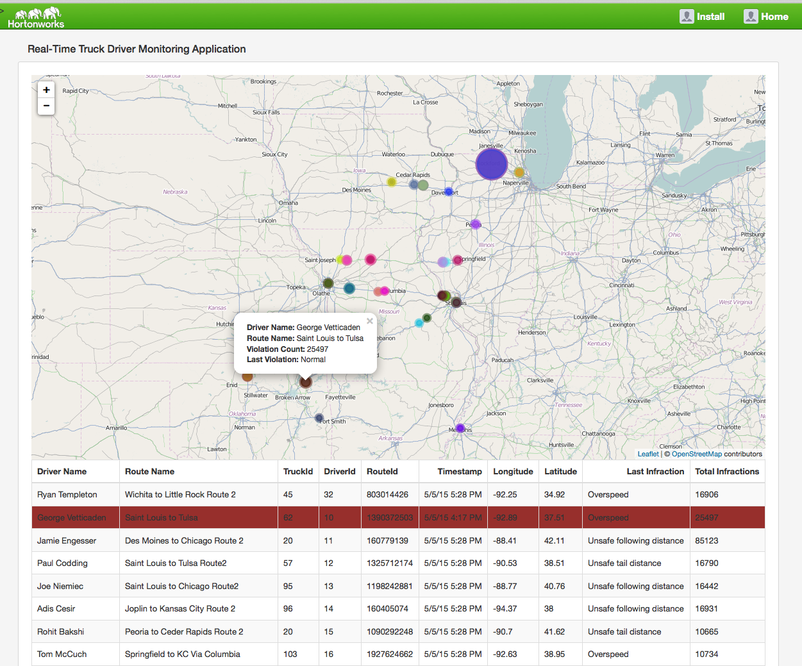
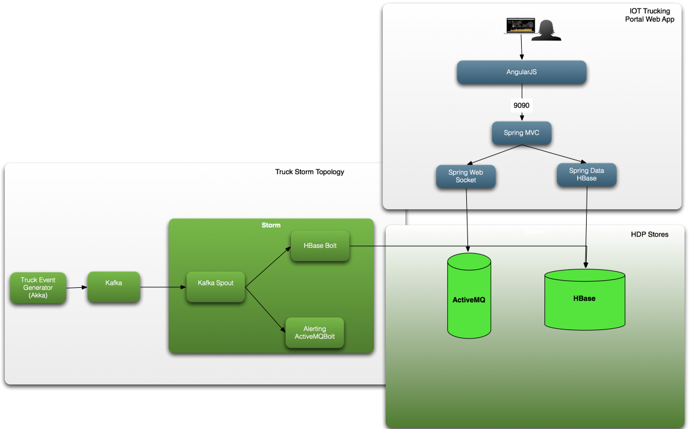

# Trucking Web Portal Application

This Spring MVC application provides a front-end portal to do the following:

1. Deploys the Storm Topology
2. Create Stream of N events from X amount of Trucks to generate data for the IOT app
3. Uses Spring MVC and websockets over STOMP/StockJS to push real-time trucking events to a Map

The below  represents what a real-time View of the Map looks like with each Circle representing a truck on a given route.

## Architecture for the Web Portal 

